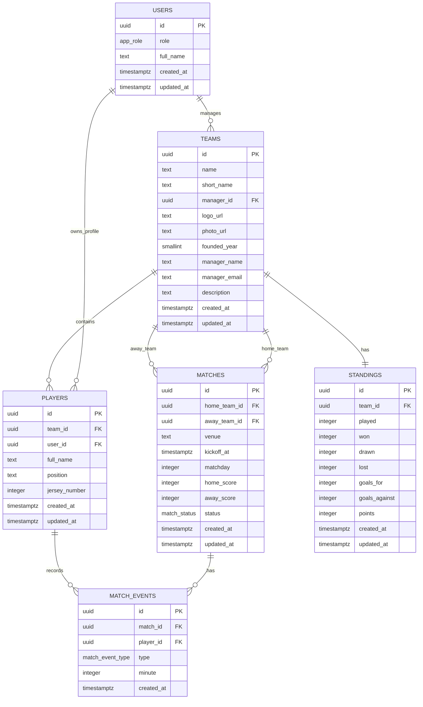

# Project Documentation

## 1. Project Description
Pro League is a football tournament management web app built as a multi-page application. It lets visitors browse the public tournament pages, while authenticated users can log in, register teams, and review live tournament information.

### What users can do
- Visitors can explore the home page, live scores, schedule, teams, and statistics pages.
- Registered users can sign in or register with Supabase Auth.
- Team managers can create a new team and upload a logo and team photo.
- Logged-in users can view the dashboard and navigate across the tournament screens.
- Admin-oriented pages and competition data are protected through role-based access control and Supabase RLS.

## 2. Architecture
### Front end
- Plain HTML, vanilla JavaScript (ES6+), CSS, and Bootstrap 5.
- Vite is used as the build tool and development server.
- The app follows an MPA approach: each screen lives in its own physical page module.
- Shared UI is handled through reusable header and footer components.
- Navigation is handled by a lightweight client-side router in `src/router.js`.

### Back end
- Supabase is used for authentication, database storage, and file storage.
- Supabase Auth manages sign up, sign in, session handling, and sign out.
- Supabase Storage stores uploaded team assets.
- PostgreSQL tables are created and maintained through SQL migrations in `supabase/migrations`.
- Row-level security is enabled to control access to protected data.

### Technologies used
- Vite
- Vanilla JavaScript
- HTML5
- CSS3
- Bootstrap 5
- Supabase JS client
- PostgreSQL via Supabase

## 3. Database Schema Design
The main database entities are:
- `users` for profile and role data
- `teams` for team identity and metadata
- `players` for roster membership and player details
- `matches` for fixtures and results
- `match_events` for events inside matches
- `standings` for league table calculations

### Relationship diagram


### Schema notes
- `users.id` mirrors `auth.users.id`.
- `teams.manager_id` links a team to the manager account.
- `players.team_id` links each player to a single team.
- `matches` stores both home and away team references.
- `match_events` stores goal, card, and substitution events.
- `standings` stores the league table totals per team.
- RLS is enabled on the main tables.

## 4. Local Development Setup Guide
### Prerequisites
- Node.js and npm
- A Supabase project with the schema migrations applied

### Install dependencies
```bash
npm install
```

### Configure environment variables
Create a local environment file named `.env.local` in the project root and set:
```bash
VITE_SUPABASE_URL=your-supabase-project-url
VITE_SUPABASE_ANON_KEY=your-supabase-anon-or-publishable-key
```

You can copy `.env.example` and fill in the real values.

### Start the development server
```bash
npm run dev
```

### Build for production
```bash
npm run build
```

### Preview the production build
```bash
npm run preview
```

### Supabase setup
- Apply the SQL migrations in `supabase/migrations`.
- Confirm that the `team-assets` storage bucket exists.
- Verify that RLS policies are enabled for the protected tables.

## 5. Key Folders and Files
### `src/`
Application source code.

### `src/main.js`
Bootstraps Bootstrap, global styles, and starts the app.

### `src/router.js`
Controls page resolution, client-side navigation, and logout handling.

### `src/components/header/`
Shared navigation header used across pages.

### `src/components/footer/`
Shared footer used across pages.

### `src/pages/`
Physical page modules for each app screen.

Important page folders:
- `src/pages/home/` for the landing page
- `src/pages/login/` for Supabase Auth sign in and registration
- `src/pages/dashboard/` for the authenticated landing page
- `src/pages/create-team/` for team creation and file upload
- `src/pages/teams/` for the live teams list
- `src/pages/live-scores/` for match updates
- `src/pages/schedule/` for fixtures
- `src/pages/statistics/` for tournament metrics
- `src/pages/scoresheet/` for match detail views

### `src/services/`
Supabase client wrappers and data services.

Important files:
- `src/services/auth.js` for session, sign in, sign up, and sign out logic
- `src/services/team.js` for team creation and asset upload handling

### `supabase/migrations/`
SQL migrations for schema, sample data, and storage/policy setup.

### `docs/required-db-schema.md`
Short schema summary for the original required database structure.

### `.env.example`
Template for required local environment variables.

### `assets/`
Local files used for testing uploads and static resources.

## 6. Reference Commands
- `npm install` to install dependencies
- `npm run dev` to start the local app
- `npm run build` to verify production output
- `npm run preview` to preview the built app
